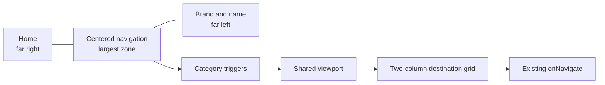
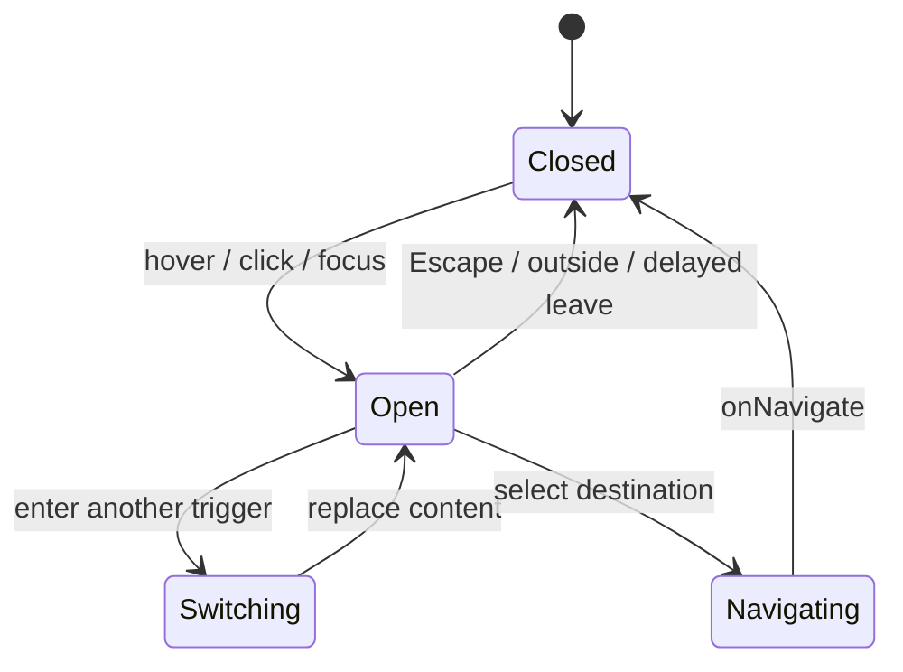

# Centered Header Mega Menu - Plan

## Goal Capsule

Rebuild the global Statisti-Kal header around a dominant centered mega menu: home at the far right, category navigation across the center, and brand mark plus product name at the far left.

The user-supplied ReUI/21st draft is authoritative for hierarchy, panel width, active-trigger treatment, two-column content, and hover/click/keyboard interaction. Project strategy and semantic tokens override its raw colors, fonts, and framework-specific code.

Stop if implementation requires changing page taxonomy, replacing the app navigation contract, or overwriting unrelated dirty-worktree changes.

---

## Product Contract

### Summary

Replace the narrow trigger-relative dropdown with a stable mega-menu surface that reads as the header's primary action area. Desktop uses three explicit zones; mobile receives a compact disclosure navigation using the same information architecture.

### Problem Frame

Current controls consume incidental space and the custom hover panel opens relative to each trigger. Its changing position and narrow shape create weak hierarchy and jumpy interaction.

### Requirements

#### Header hierarchy

- R1. Desktop places home at the far right, category navigation in the visual center, and logo plus Statisti-Kal name at the far left.
- R2. Center navigation receives the largest flexible region and remains visually dominant across supported desktop widths.
- R3. Active page and category remain identifiable without depending only on color.

#### Mega-menu behavior

- R4. Category triggers open one shared wide panel below the centered navigation, not separate narrow panels.
- R5. Panel content uses real destinations with icon, Hebrew title, and short description in a responsive two-column grid.
- R6. Desktop supports hover with close delay, click toggle, keyboard focus, Escape close, and outside-click close.
- R7. Switching triggers replaces content inside a stable panel without a large positional jump.
- R8. Destination selection closes the menu and delegates through existing `onNavigate`.

#### Responsive, accessible, and visual behavior

- R9. Below desktop breakpoint, a menu toggle opens a vertically grouped list; desktop hover behavior is disabled.
- R10. Expanded/current state, keyboard reachability, visible focus, and reduced-motion behavior are preserved.
- R11. RTL order, arrow direction, text alignment, focus flow, and panel alignment are correct in Hebrew.
- R12. Layout, typography, surfaces, borders, shadows, and states use existing semantic tokens.
- R13. Reuse Lucide and shared layout primitives; add only an accessibility primitive the repo lacks.

### Acceptance Examples

- AE1. On a desktop hypothesis page, home is at the right edge, inference is centered/current, and brand is at the left edge.
- AE2. Hovering or focusing inference opens a stable wide panel with hypothesis, point estimation, and regression cards.
- AE3. Moving from inference to resources retains the panel origin and replaces its content.
- AE4. Escape or outside click closes the panel with predictable focus behavior.
- AE5. At mobile width, no desktop popup is keyboard-reachable; the toggle reveals all grouped destinations.

### Success Criteria

- Requested right/center/left hierarchy holds at desktop widths.
- Mega-menu is prominent, stable, and wide enough for two-column cards.
- Every current `SitePage` remains reachable on desktop and mobile.
- Keyboard, pointer, RTL, active-state, and responsive scenarios have automated coverage.
- TypeScript, color lint, tests, and production build pass without regressions.

### Scope Boundaries

#### In scope

- Global `SiteHeader` structure and navigation presentation.
- Reusable accessible navigation primitive.
- Navigation grouping, icons, Hebrew labels, and concise descriptions.
- Desktop mega-menu, mobile disclosure, and interaction tests.

#### Deferred to Follow-Up Work

- Migrating local `activePage` state to URL routing.
- Redesigning page content, footer, guided-tour copy, or table of contents.
- Replacing the brand mark or broader identity.

---

## Planning Contract

### Key Technical Decisions

- KTD1. Use a three-column CSS grid rather than RTL flex ordering. Fixed edge zones plus a flexible center prevent home or brand width from shifting the menu.
- KTD2. Use Radix Navigation Menu for controlled state, keyboard semantics, direction support, shared viewport sizing, and motion attributes. Install through npm without guessing a version.
- KTD3. Add only the Radix navigation dependency. Lucide and Motion already exist; CVA is unnecessary for this small variant surface.
- KTD4. Render one shared viewport beneath the centered root. Category content changes inside it, preserving a stable origin.
- KTD5. Keep one typed navigation model for desktop and mobile: `SitePage`, Hebrew label, description, and icon.
- KTD6. Preserve the public `activePage` / `onNavigate` contract. Open state remains internal UI state.
- KTD7. Desktop follows the reference's hover/focus plus click behavior; mobile uses a separate click disclosure.
- KTD8. Replace the current untracked custom hover implementation rather than layering a second system. Preserve unrelated dirty changes.

### High-Level Technical Design

### Implementation Constraints

- Consume semantic tokens from `web/src/index.css` and follow the global templating architecture.
- Keep calculator logic untouched.
- Preserve `tour-nav-*` hooks unless current tour configuration proves them unused.
- Do not copy Next.js `Link`, `'use client'`, path aliases, or raw draft styles into Vite.
- Reconcile dirty `package.json` and lockfile state; do not discard unrelated edits.

### Sequencing

U1 establishes the primitive and typed model. U2 composes responsive header surfaces. U3 closes integration and browser-verification gaps.

---

## Implementation Units

### U1. Build the stable navigation primitive and data model

**Goal:** Replace the custom Motion hover wrapper with a Radix-backed primitive and one typed model.

**Requirements:** R4-R8, R10-R13.

**Dependencies:** None.

**Files:**

- `web/package.json`
- `web/package-lock.json`
- `web/src/components/ui/navbar-menu.tsx`
- `web/src/components/ui/navbar-menu.test.tsx`

**Approach:** Wrap Radix root, list, item, trigger, content, link, indicator, and viewport with project-token classes and RTL support. Expose controlled value hooks and keep navigation side effects outside the primitive.

**Patterns to follow:** `web/src/components/ui/TableOfContents.tsx` and its test for controlled disclosure semantics and Testing Library patterns.

**Test scenarios:**

1. RTL root renders one horizontal list and shared viewport.
2. Hover or focus opens a trigger and updates expanded state.
3. Switching triggers changes content while retaining the viewport container.
4. Escape and focus leaving navigation close content.
5. Reduced motion preserves understandable states.

**Verification:** Strict TypeScript passes and the primitive has no Next.js dependency or duplicated page-navigation logic.

### U2. Rebuild SiteHeader into right-center-left zones

**Goal:** Implement requested hierarchy and populate the mega menu with real destinations.

**Requirements:** R1-R13; AE1-AE5.

**Dependencies:** U1.

**Files:**

- `web/src/components/SiteHeader.tsx`
- `web/src/components/SiteHeader.test.tsx`
- `web/src/components/LandingPage.tsx`
- `web/src/components/ui/PageLayout.tsx`

**Approach:** Render home at RTL start/right, navigation in the flexible center, and clickable brand at left. Use wide two-column panels with Hebrew descriptions. Add a mobile toggle and vertical grouped list from the same data model. Adjust outer layout only where it blocks intended width or leaves obsolete spacing.

**Execution note:** Preserve page behavior first; restructuring must not change `SitePage` or callback semantics.

**Patterns to follow:** Existing `BrandMark`, sticky `PageLayout`, typography utilities, `tour-nav-*` hooks, and Lucide usage.

**Test scenarios:**

1. AE1: hypothesis state renders correct zones and current inference trigger.
2. AE2: inference panel contains its three destination cards with descriptions.
3. AE3: switching category reuses the viewport.
4. AE4: Escape and outside pointer close the panel.
5. Destination click calls `onNavigate` once and closes.
6. Home and brand call `onNavigate('landing')`; home exposes current state on landing.
7. AE5: mobile exposes toggle/grouped list while desktop popup is unreachable.
8. Every modeled destination appears on desktop and mobile.

**Verification:** Hierarchy matches reference at desktop widths, remains usable on mobile, and callbacks preserve current behavior.

### U3. Close integration, accessibility, and visual-regression gaps

**Goal:** Verify the rebuilt header in its real sticky layout and prevent clipping, RTL, and navigation regressions.

**Requirements:** R2-R3, R6-R11.

**Dependencies:** U1, U2.

**Files:**

- `web/src/components/SiteHeader.test.tsx`
- `web/src/components/ui/navbar-menu.test.tsx`
- `web/src/App.tsx`
- `web/src/config/tours.ts`

**Approach:** Update App or tour code only if rebuilt markup breaks current integration. Cover normal-mode mapping, tour selectors, sticky stacking, shared viewport clipping, and RTL keyboard order.

**Execution note:** Use browser smoke proof after component tests because jsdom cannot prove geometry, stacking, or hover corridors.

**Test scenarios:**

1. Forward/inverse selection still maps to normal calculator modes.
2. Guided-tour selectors still resolve.
3. Wide panel stays inside viewport and above page content.
4. At breakpoint boundary only one navigation surface is reachable.
5. RTL arrow behavior and visual order match Radix direction semantics.
6. Rapid pointer movement between trigger and panel does not flicker.

**Verification:** Browser checks confirm stable placement in light/dark themes, keyboard completion, RTL order, and no sticky-layer overlap.

---

## Verification Contract

- From `web/`: `npm run lint:tsc`.
- Run focused Vitest for `SiteHeader.test.tsx` and `ui/navbar-menu.test.tsx`, then `npm test`.
- Run `npm run lint:colors` and `npm run build`.
- Browser-smoke around 1024, 1280, and 1440 pixels plus mobile around 390 pixels.
- Verify light/dark themes, pointer, keyboard, Escape/outside close, active states, and reduced motion.
- Review git diff and confirm unrelated dirty files were not rewritten or removed.

---

## Risks & Dependencies

- Worktree contains unrelated and overlapping changes; implementation must merge deliberately around header and manifests.
- Radix defaults are hover-oriented. Controlled state must preserve click toggling without fighting its keyboard model.
- Shared viewport can clip through ancestor overflow or sticky stacking contexts.
- Local page state remains; browser back/forward behavior stays outside scope.
- jsdom cannot validate geometry, so browser smoke verification is mandatory.

---

## Definition of Done

- U1-U3 verification outcomes pass.
- Desktop follows home-right, menu-center, brand-left hierarchy.
- Shared panel remains anchored and presents Hebrew destinations in two columns.
- Mobile has complete click-driven grouped navigation.
- Destinations, tour hooks, and normal-mode mapping continue working.
- UI uses semantic tokens, RTL keyboard behavior, and reduced motion.
- TypeScript, tests, color lint, and build pass or pre-existing unrelated failures are documented exactly.
- Superseded custom-menu code and unused styling are removed; unrelated user changes remain intact.
